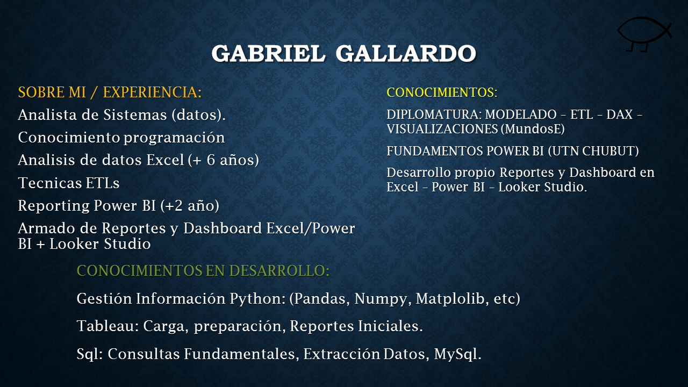
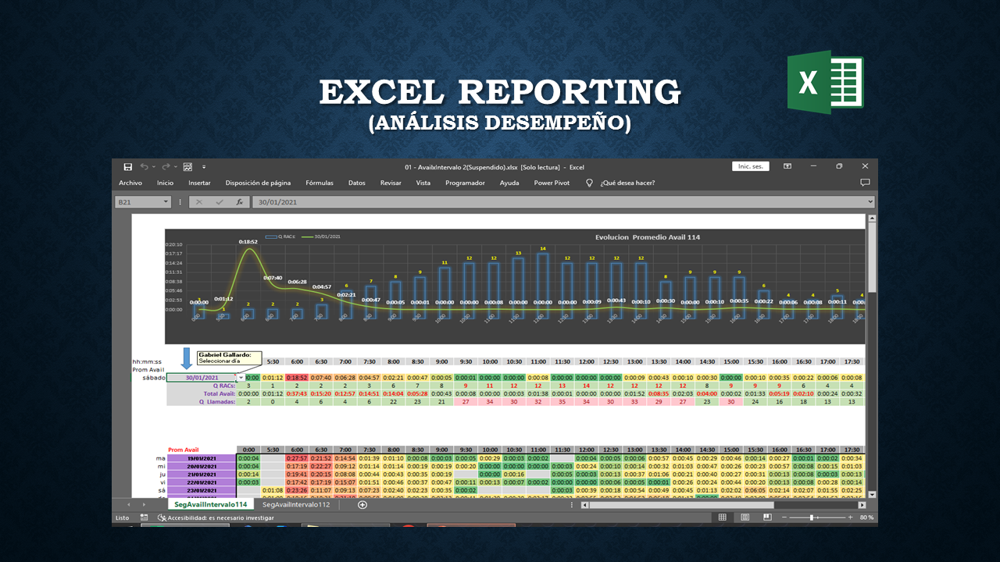
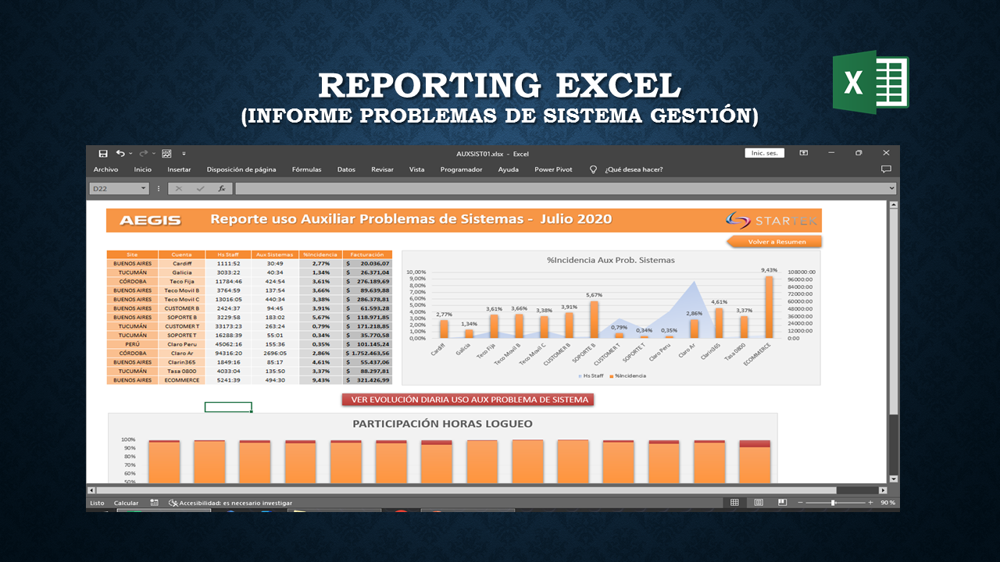
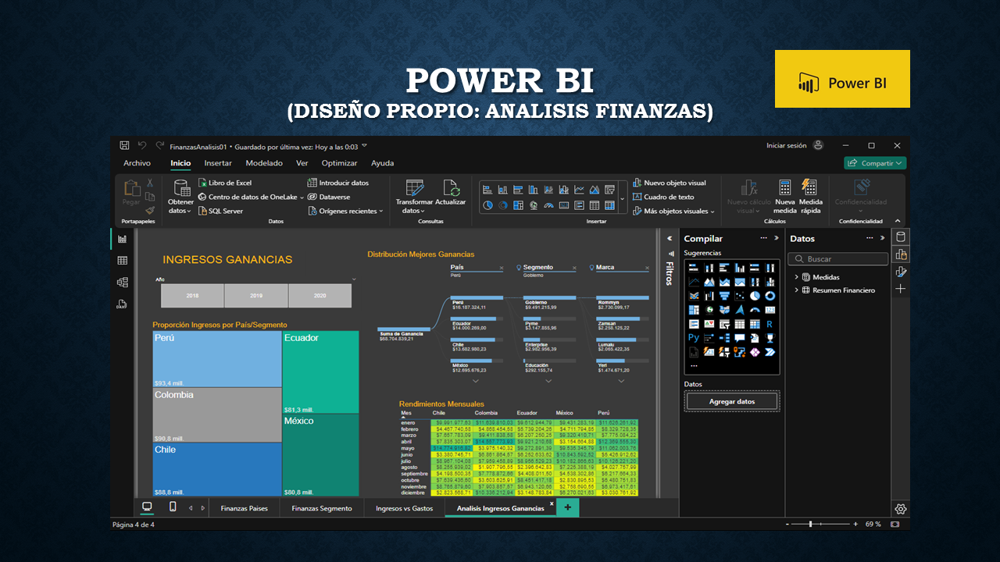
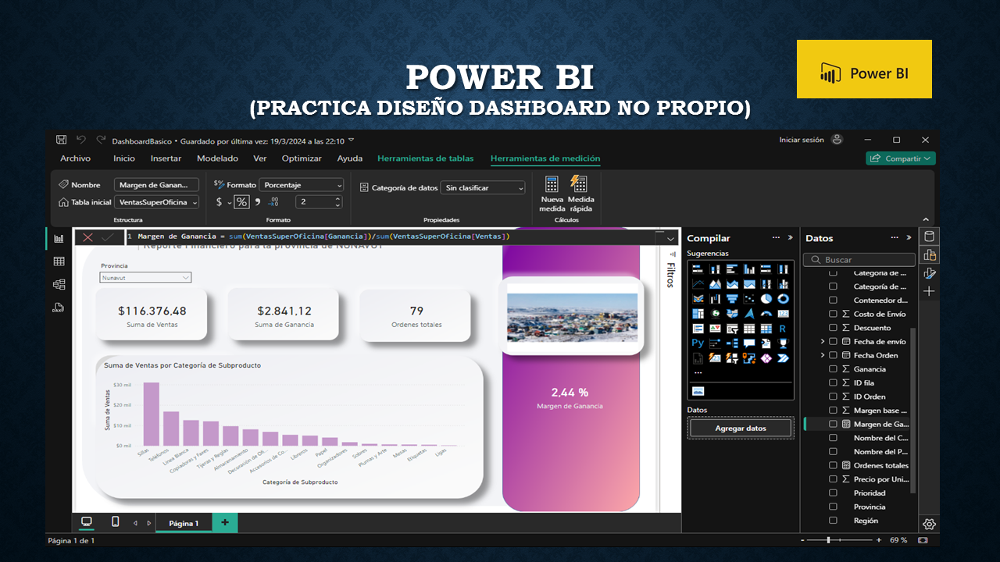
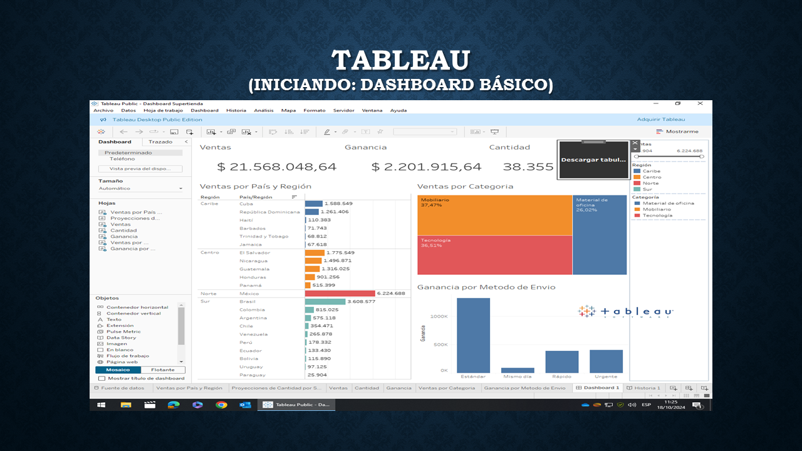
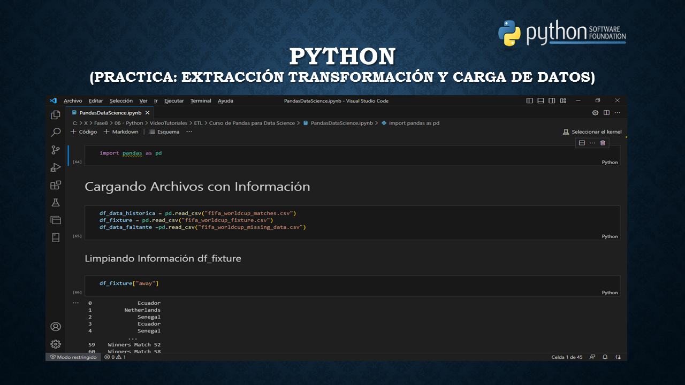
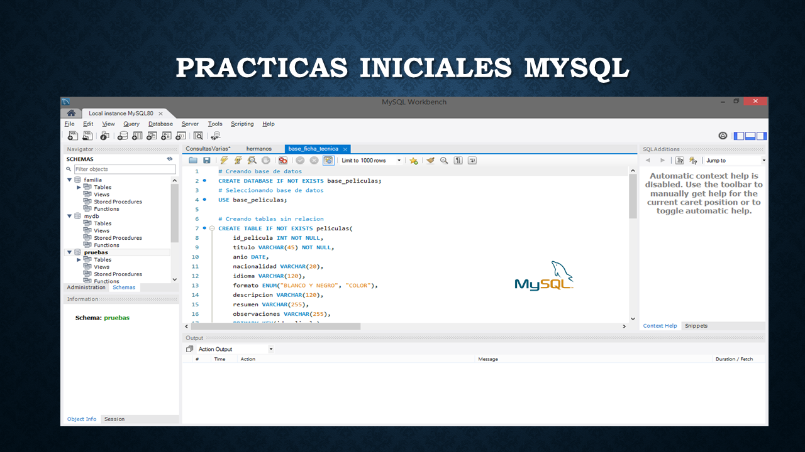

# Recorrido Portfolio Migracion Excel a Power BI  

## 📊 Resumen Reporteria Excel con transicion a Power BI mas Herramientas Complementarias

Un breve recorrido desde los ultimos reportes bajo Excel, pasando por los primeros dashboards en Power BI.
Un primer acercamiento a la plataforma Tableau.
Implementacion de herramientas complementarias como Pyhton para ETL/EDA y Mysql para obtencion de datos.

## 🖼️ Vista previa

## 🚀 Tecnologías
- Microsoft Excel - Tablas Dinamicas
- Power BI Desktop
- Tableu
- Python
- Mysql

##### 👨‍💻 Author
##### Gabriel Gallardo
